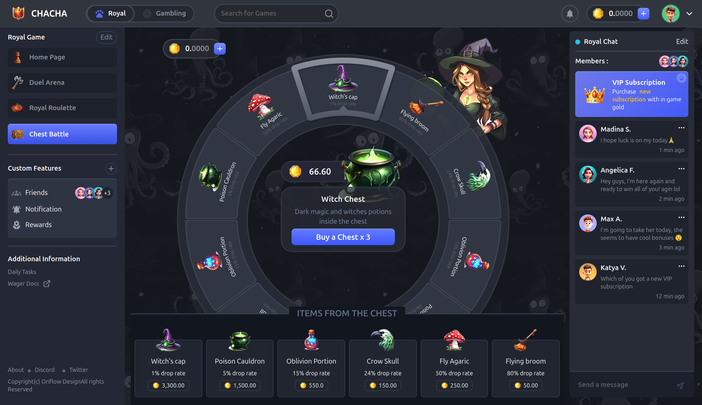

# 🎡 Web3 Spin Quest

A modern Web3-enabled browser game built to onboard users into blockchain through fun, skill-based gameplay, collectibles, and on-chain rewards.

This project focuses on **user experience first**, making Web3 feel simple, fast, and enjoyable — especially for new users.

---

## 🌍 Project Overview

**Web3 Spin Quest** is a decentralized game where players interact with a spinning wheel mechanic to earn points, collectibles, and blockchain-based rewards.

The game blends:
- Interactive SVG animations
- Real-time UI feedback
- Smart contract integrations
- Wallet-based player identity

It is designed to be **lightweight**, **mobile-friendly**, and **easy to extend**.

---

## 🚀 Features

### 🎡 Gameplay
- ✅ Interactive spinning wheel
- ✅ Smooth animations (GSAP-ready)
- ✅ Randomized outcomes with clear probabilities
- ✅ Visual feedback for wins and rewards

### 🔗 Web3 Integration
- ✅ Wallet connection (MetaMask / WalletConnect)
- ✅ On-chain player identity
- ✅ Smart contract–driven rewards
- ✅ NFT / token-ready architecture

### 🧠 User Experience
- ✅ No Web3 knowledge required to start
- ✅ Clean UI with Tailwind CSS
- ✅ Responsive design (desktop & mobile)
- ✅ Fast loading and optimized SVG rendering

---

## 🛠️ Tech Stack

### Frontend
- **React** - Component-based UI
- **Tailwind CSS** - Utility-first styling
- **SVG + GSAP** - Smooth animations
- **Vite / Next.js** - Build tooling (optional)

### Web3
- **Ethers.js / Wagmi** - Blockchain interaction
- **Smart Contracts** - Solidity
- **Testnet-first** deployment
- **WalletConnect / MetaMask** - Wallet integration

### Backend (Optional)
- **Node.js** - API services
- **API for off-chain metadata** - Player stats, leaderboards
- **Event indexing** - The Graph / custom indexer

---

## 📁 Project Structure

```
src/
├── components/
│   ├── wheel/
│   │   ├── Roll.jsx
│   │   ├── wheelData.js
│   │   └── wheelAnimation.js
│   │
│   ├── ui/
│   │   ├── Button.jsx
│   │   └── Modal.jsx
│   │
│   └── layout/
│       └── Navbar.jsx
│
├── pages/
│   └── Game.jsx
│
├── hooks/
│   └── useWallet.js
│
├── contracts/
│   └── SpinGame.sol
│
└── utils/
    └── helpers.js
```

---

## 🧩 Smart Contract Overview

The smart contract handles:
- Player registration
- Spin validation
- Reward distribution
- Event emission for frontend sync

### Example Responsibilities
- Prevent multiple spins in short time
- Store player scores
- Mint NFTs or tokens as rewards
- Emit events for UI updates

---

## 🔐 Security Considerations

- ✅ No private keys stored
- ✅ Wallet-based authentication only
- ✅ All rewards validated on-chain
- ✅ Rate-limiting for game actions
- ✅ Tested on testnet before mainnet

---

## 🧪 Running Locally

```bash
git clone https://github.com/your-username/web3-spin-quest.git
cd web3-spin-quest
npm install
npm run dev
```

Then open:
```
http://localhost:5173
```

---

## 🌐 Deployment

| Component | Platform |
|-----------|----------|
| **Frontend** | Vercel / Netlify |
| **Contracts** | Testnet → Mainnet |
| **Assets** | IPFS / Cloud CDN |

---

## 🎯 Roadmap

- [x] Wallet connection
- [x] On-chain spin logic
- [ ] NFT rewards
- [ ] Leaderboard
- [ ] Multiplayer challenges
- [ ] Mobile optimization
- [ ] Mainnet launch

---

## 🤝 Contributing

Contributions are welcome!

1. **Fork** the repository
2. Create a **feature branch** (`git checkout -b feature/amazing-feature`)
3. **Commit** your changes (`git commit -m 'Add amazing feature'`)
4. **Push** to the branch (`git push origin feature/amazing-feature`)
5. Open a **Pull Request**

---

## 📜 License

**MIT License**

Free to use, modify, and distribute.

---

## 👤 Author

**Abdulai Osman**

Web Developer | Web3 Builder | UI Engineer

- GitHub: [@your-username](https://github.com/your-username)
- Twitter: [@your-handle](https://twitter.com/your-handle)
- LinkedIn: [Your Name](https://linkedin.com/in/your-profile)

---

## ⭐ Support

If you like this project:
- ⭐ **Star** the repo
- 🧠 **Share** feedback
- 🤝 **Contribute** ideas

---

## 📸 Screenshots

### Game Interface


### Wallet Connection


### Reward Screen


---

## 🔥 What's Next?

I can help you with:
- 🏆 **Hackathon version** - Pitch-focused README
- 💼 **Investor deck** - Business-oriented documentation
- 📚 **Smart contract docs** - Technical deep-dive
- 🎓 **Non-tech version** - Simplified for general audience

Just let me know! 🚀
